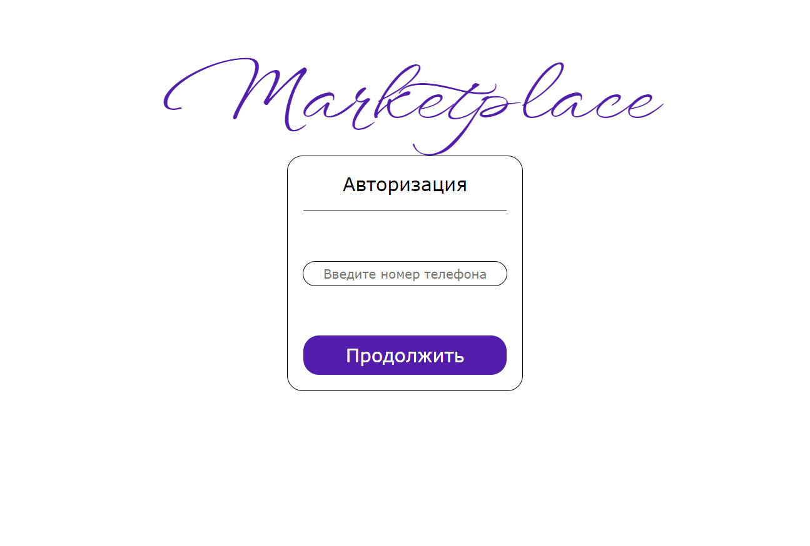

# Проект тестирования авторизации в маркетплейсе

В этом проекте будут использоваться web-технологии, а именно HTML, CSS, JavaScript, основной библиотекой, используемой в качестве фреймворка является [React](https://react.dev/), в качестве сборщика приложения применяется [Vite](https://vitejs.dev/), также для проведения модульного тестирования используется специализированная библиотека [Jest](https://jestjs.io/ru/). Для проведения интеграционного тестирования применяется библиотека [Selenium](https://www.selenium.dev/). Для документирования кода используется библиотека [JSDock](https://jsdoc.app/)

Для проведения тестирования реализованы две страницы:
1. Страница ввода номера телефона;

2. Страница ввода кода из СМС.

У каждой страницы есть своя функция проверки валидности введенных данных, эти самые функции протестированы с помощью библиотеки [Jest](https://jestjs.io/ru/).

В свою очередь тестирование UI компонентов размещенных на этих страницах проведено благодаря библиотеке [Selenium](https://www.selenium.dev/).

Результат документирования кода при помощи библиотеки [JSDock](https://jsdoc.app/) можно увидеть если запустить файл index.html в папке docs.